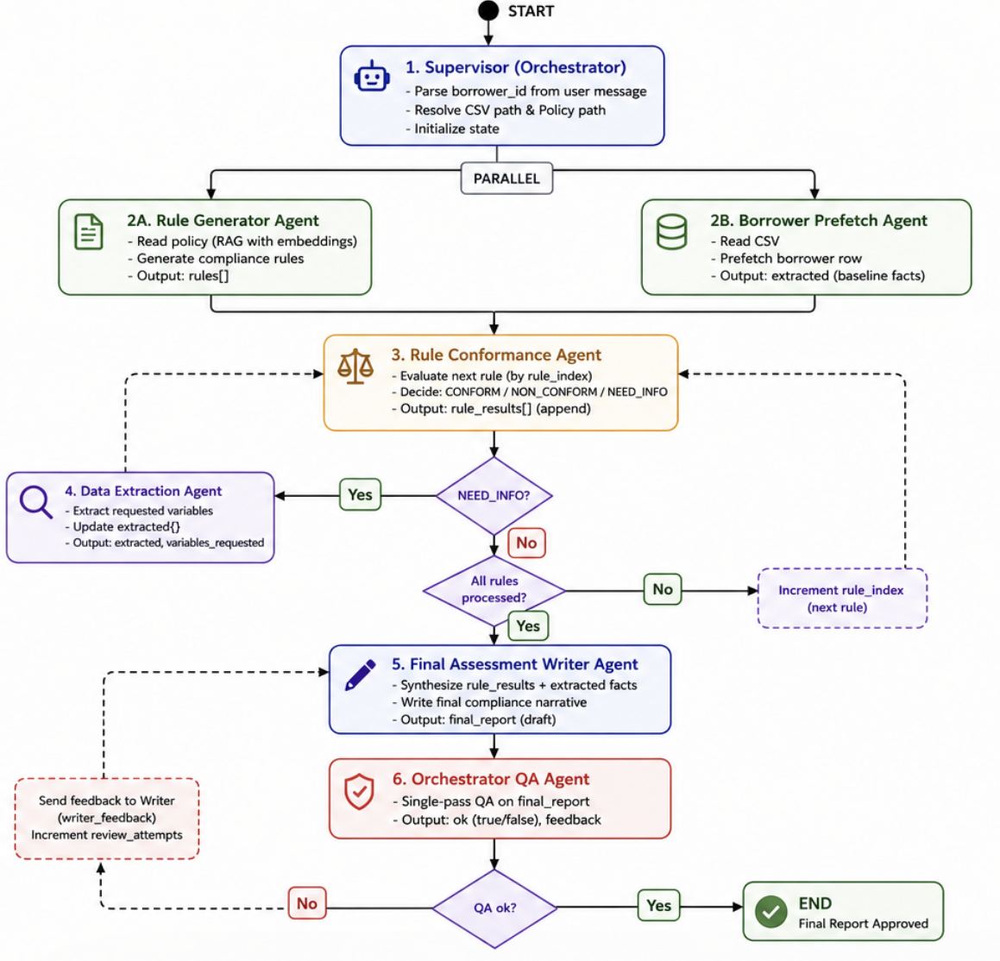

# Margin loan compliance — multi-agent LangGraph

## Overview



This repository demonstrates an **end-to-end multi-agent workflow** for **margin lending compliance**. A user requests an assessment for a specific borrower; the system reads structured client data and policy material, **generates compliance rules** from the policy, **checks each rule** against the borrower’s record, optionally **pulls additional fields** when needed, and produces a **single narrative report** summarizing conformance and reasoning.

The implementation uses **LangGraph** (on top of LangChain) so steps are explicit nodes with shared **state**, clear **control flow**, and **parallel** work where safe.

---

## What problem it solves

Manual policy review does not scale when rules are numerous and data lives in CSVs and long policy documents. This project automates a repeatable pipeline:

- **Policy → machine-checkable rules** (with retrieval over embedded policy text where configured).
- **Per-borrower verification** using the client dataset, with **on-demand extraction** when a rule needs columns not yet loaded.
- **Auditable outputs**: structured per-rule results plus a **final written assessment** suitable for review.

It is intended as a **lab / reference architecture** for supervisor-style graphs, specialist agents, and hybrid deterministic + LLM steps—not production legal advice.

---

## How LangGraph is used here

LangGraph models the workflow as a **state machine**:

1. **Shared state (`MarginState`)** holds messages, borrower id, file paths, generated `rules`, incremental `extracted` fields, `rule_results`, flags such as `need_extraction` / `conform_done`, and the `final_report`. List and dict fields use **reducers** (for example merging extracted keys and appending rule outcomes) so parallel and repeated updates combine safely.

2. **Supervisor** (`supervisor_node`) runs first: resolves CSV and policy paths (CLI defaults or environment variables), parses **borrower_id** from the user message, and resets per-run fields.

3. **Rule generation** — Control flows **`supervisor` → `rule_generator` → `rule_conformer`**. The rule generator writes policy-derived artifacts under **`artifacts/markdown/`** (see `agent2_rule_generator`) before conformance begins.

4. **Rule conformer loop** — For each rule, the conformer plans required columns, compares them to `extracted`, and either routes to **`data_extractor`** (to fetch missing fields) or records an assessment and advances. Routing uses **`route_after_conformer`**: extraction when needed, **`final_assessment_writer`** when all rules are done, otherwise back to **`rule_conformer`** for the next rule.

5. **Terminal node** — **`final_assessment_writer`** consumes structured `rule_results` and writes the narrative; the graph ends at **`END`**.

The graph is built in **`margin_graph.py`** (`build_graph()`). The file is not named `langgraph.py` so it does not shadow the installed **`langgraph`** package on `sys.path`. The Streamlit app imports `margin_graph` and streams the same compiled graph for an interactive activity log.

---

## Prerequisites

- Python **3.11+** recommended  
- An **OpenAI API key** (chat + embeddings as configured in code / env)  
- Optional: **PDF policy** support may require installing MarkItDown with PDF extras as noted in `requirements.txt`

Use the project **`.venv`** so versions match **`langchain>=1.1`** and **`langgraph`** from `requirements.txt`.

---

## Setup and run

From the **repository root** (this folder):

```bash
python3 -m venv .venv
source .venv/bin/activate   # Windows: .venv\Scripts\activate

pip install -r requirements.txt

export OPENAI_API_KEY="sk-..."
# Optional overrides:
# export OPENAI_MODEL=gpt-4o-mini
# export OPENAI_EMBEDDING_MODEL=text-embedding-3-small
# export MARGIN_CLIENT_CSV=/path/to/clients.csv
# export MARGIN_POLICY_PATH=/path/to/policy.md   # or .pdf per your pipeline
```

**CLI — full workflow** (run from repository root so agent modules resolve)

```bash
python -m margin_graph "Assess borrower_id=11 for margin loan compliance."
```

**Web UI — full workflow**

```bash
streamlit run streamlit_app.py
```

You can place secrets in a **`.env`** file in the project root; Streamlit and other entrypoints load it where `python-dotenv` is used.

---

## Project layout (high level)

| Area | Role |
|------|------|
| `margin_graph.py` | LangGraph definition, supervisor, routing, CLI entry (`python -m margin_graph`) |
| `agent2_rule_generator.py` | Policy-grounded rule generation |
| `agent3_rule_conformer.py` | Per-rule planning and conformance checks |
| `agent1_data_extractor.py` | On-demand CSV extraction (pandas agent + deterministic fallback) |
| `agent4_final_assessment_writer.py` | Final narrative agent |
| `streamlit_app.py` | Browser UI and streaming graph run |
| `data/` | Sample CSV, sample policy, assets (`diagram.png` workflow figure) |

---

## Diagram asset

The overview figure is expected at **`data/diagram.png`**. If the image does not render, add or export your workflow graphic to that path (same directory as the sample `fake_margin_loan_dataset.csv` and `margin_loan_policy.md`).
